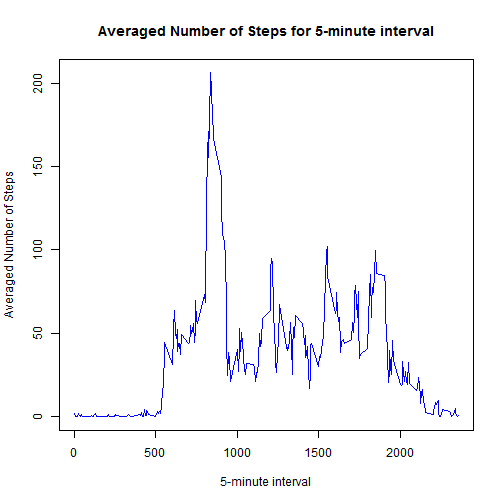

# Reproducible Research: Peer Assessment 1

## Loading and preprocessing the data


```r
rawdata <- read.csv("activity.csv")
data <- rawdata
```


## What is mean total number of steps taken per day?
### 1 The following plot shows the histogram of the total number of steps taken each day with ignoring missing values.


```r
stepsPerDay <- tapply(data$steps, data$date, sum, na.rm = T)
hist(stepsPerDay, breaks = 10, col = "red", main = "Histogram of Steps per Day", 
    xlab = "Steps per Day", ylab = "Frequency")
```

 


### 2 Calculate and report the mean and median total number of steps taken per day

```r
meanSPD <- mean(stepsPerDay)
medianSPD <- median(stepsPerDay)
```


The mean of total number of steps taken per day is  9354.2295.     
The median of total number of steps taken per day is  10395.

## What is the average daily activity pattern?
### 1 Make a time series plot (i.e. type = "l") of the 5-minute interval (x-axis) and the average number of steps taken, averaged across all days (y-axis)


```r
stepsPerInterval <- tapply(data$steps, data$interval, mean, na.rm = T)
plot(unique(data$interval), stepsPerInterval, type = "l", xlab = "5-minute interval", 
    main = "Averaged Number of Steps for 5-minute interval", ylab = "Averaged Number of Steps", 
    col = "blue", pch = 19)
```

 


### 2 Which 5-minute interval, on average across all the days in the dataset, contains the maximum number of steps?

```r
maxInterval <- unique(data$interval)[stepsPerInterval == max(stepsPerInterval)]
```

The 5-minute interval, on average across all the days in the dataset,     
contains the maximum number of steps is 835.

## Imputing missing values
### 1 Calculate and report the total number of missing values in the dataset (i.e. the total number of rows with NAs)

```r
numNA <- sum(is.na(data$steps))
```

The total number of missing values in the dataset is 2304.

### 2 Devise a strategy for filling in all of the missing values in the dataset. 
The strategy for filling in all missing values in the dataset is to use the mean value of the same day the value is missing.
### 3 Create a new dataset that is equal to the original dataset but with the missing data filled in.

```r
newDataSet <- data
for (i in 1:nrow(newDataSet)) {
    if (is.na(newDataSet$steps[i])) {
        dateIdx <- which(unique(newDataSet$date) == newDataSet$date[i])
        newDataSet$steps[i] <- stepsPerDay[dateIdx]/length(unique(newDataSet$interval))
    }
}
```

### 4 Make a histogram of the total number of steps taken each day and Calculate and report the mean and median total number of steps taken per day. Do these values differ from the estimates from the first part of the assignment? What is the impact of imputing missing data on the estimates of the total daily number of steps?

#### The following plot shows the histogram of the total number of steps taken each day for imputed dataset.

```r
stepsPerDay <- tapply(newDataSet$steps, newDataSet$date, sum)
hist(stepsPerDay, breaks = 10, col = "red", main = "Histogram of Steps per Day of Imputed Dataset", 
    xlab = "Steps per Day", ylab = "Frequency")
```

 


```r
meanSPD <- mean(stepsPerDay)
medianSPD <- median(stepsPerDay)
```


The mean of total number of steps taken per day is  9354.2295.     
The median of total number of steps taken per day is  1.0395 &times; 10<sup>4</sup>.    

**The mean and median values of steps taken per day are the same as the one estimated with ignoring missing value.     
There is no impact for imputing missing values using the mean value of steps at the same day.**    

By inspecting the data, missing values are observed for either all intervals or none interval on the same days.
This is why it is not impacted by imputing missing values with mean value of the same day.

## Are there differences in activity patterns between weekdays and weekends?

### 1 Create a new factor variable in the dataset with two levels - "weekday" and "weekend" indicating whether a given date is a weekday or weekend day.

```r
newDataSet$date <- strptime(as.character(newDataSet$date), "%Y-%m-%d")
newDataSet$day <- as.factor(ifelse(weekdays(newDataSet$date) %in% c("Saturday", 
    "Sunday"), "Weekend", "Weekday"))
```


### 2 Make a panel plot containing a time series plot (i.e. type = "l") of the 5-minute interval (x-axis) and the average number of steps taken, averaged across all weekday days or weekend days (y-axis). 

```r
plotdata <- aggregate(steps ~ interval + day, newDataSet, mean)
library(ggplot2)
g <- ggplot(plotdata, aes(interval, steps))
g + geom_line(size = 0.8, col = "blue") + facet_grid(day ~ .) + labs(title = "Averaged Number of Steps for 5-minutes Interval")
```

 


